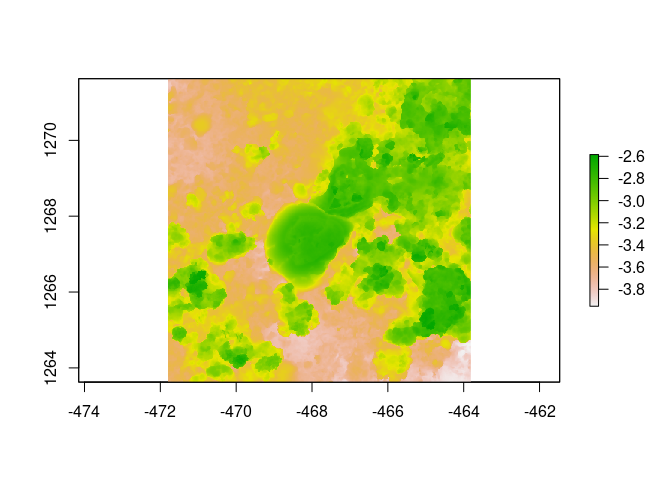

Assignment
================
N.S.
2023-08-09

## R packages

Here I make sure I can load all packages.

``` r
library(raster)
library(habtools)
library(ggplot2)
library(dplyr)
library(fishualize)
plot(horseshoe)
```

<!-- -->

## About me

Tell us something about yourself.  
Include:  
- Current lab  
- Project focus  
- Why you chose this course  
- R experience  
- Fun fact
